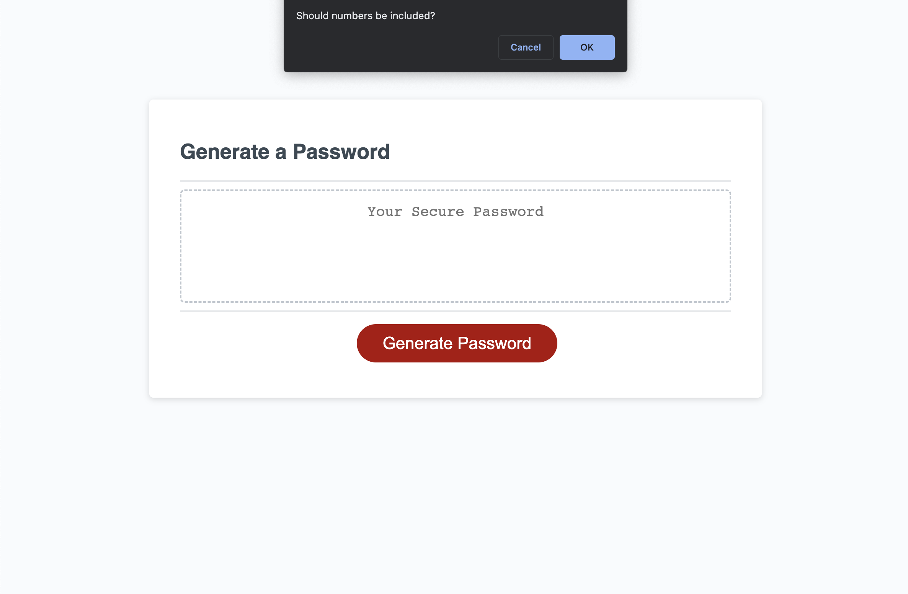
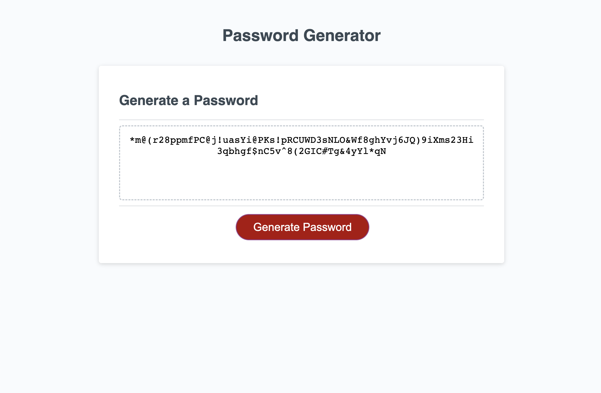

# Password Generator

## Introduction
This project is a result of our bootcamp's week 3 homework assignment. Students were expected to create a password generator meeting certain criteria, which would build off of the provided starter code. The project repository can be found [here](https://github.com/graycodesnu/password_generator) and the live link can be found [here](https://graycodesnu.github.io/password_generator/).

## Goals 
The goal of this assignment was to create a password generator that would meet certain criteria:

+ The user is presented with criteria for their password 
+ User chooses the length of their password 
+ User chooses whether they want to include lowercase letters, uppercase letters, numbers, and/or symbols
+ Once criteria selections are made, a password is generated matching the user's selections
+ The generated password is written to the page

## Results 
Despite struggling throughout my first several attempts at this project, it has been extremely satisfying to be able to revisit and refactor this code near the end of boot camp. After four months of progress in the course, `Math.floor` and `Math.random` make much more sense, in addition to rendering items to the page using JavaScript. 

I was able to define character variables, require them (or not) based on user input, and get the result to render to the page. 