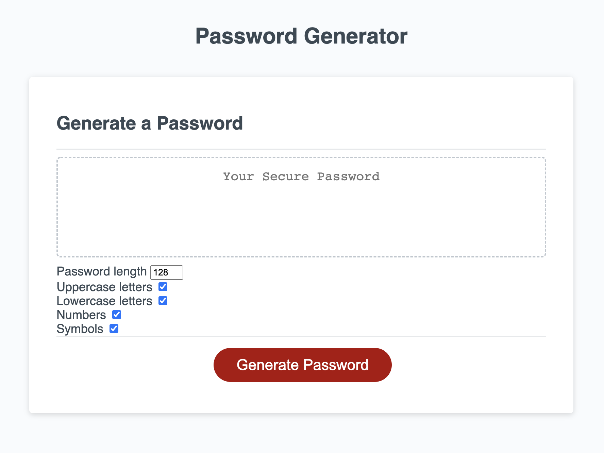

# Password Generator

## Introduction
This project is a result of our bootcamp's week 3 homework assignment. Students were expected to create a password generator meeting certain criteria, which would build off of the provided starter code. The project can be found [here](https://github.com/graycodesnu/password_generator).

## Goals 
The goal of this assignment was to create a password generator that would meet certain criteria:

+ The user is presented with criteria for their password 
+ User chooses the length of their password 
+ User chooses whether they want to include lowercase letters, uppercase letters, numbers, and/or symbols
+ Once criteria selections are made, a password is generated matching the user's selections
+ The generated password is written to the page

## Results 
I found this project to be difficult and ended up completely starting over twice. Once I was finally able to figure out the functions I needed for my criteria variables, the project started to make more sense. 

Despite the criteria functions coming together, I could not figure out how to write the password result to the page or the for loop in order for the functions to stop running. I have written lines of code to the page, but have not been able to generate the password. I wrote several lines of pseudo code, tried countless approaches, spent two tutoring sessions and utilized the AskBCS feature to ask questions throughout this assignment, but I still did not meet the criteria needed when it comes to appending the new password to the page. 

At this point, I am not sure what I'm missing in my code and have resigned to submitting this project with the code that I do have rather than completely starting over again, in hopes that I'll receive useful feedback with which I can point myself in the right direction and resubmit this assignment. 